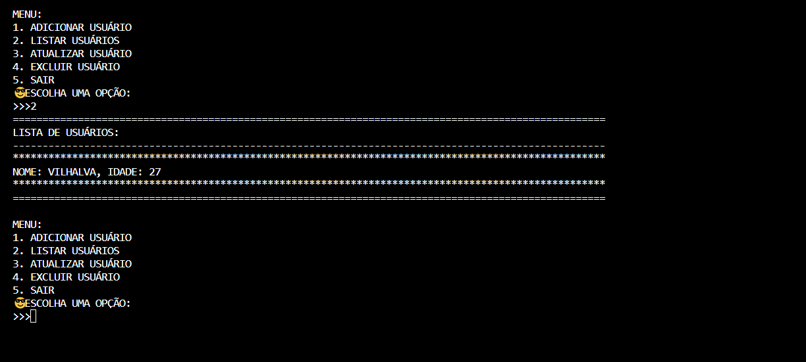

# CRUD PYTHON EM TXT
🎈GERENCIE O NOME E IDADE DOS USUÁRIOS EM UM ARQUIVO TXT.

 <br>

## DESCRIÇÃO:
O aplicativo é um sistema básico de gerenciamento de usuários implementado em Python, utilizando um paradigma de CRUD (Create, Read, Update, Delete) para realizar operações simples em um arquivo de texto.

## FUNCIONALIDADES:
1. **Adicionar Usuário:**
   - Permite a adição de um novo usuário ao sistema.
   - Solicita o nome e a idade do usuário por meio da entrada do usuário.
   - Os dados do usuário são armazenados em um arquivo de texto chamado `"usuarios.txt"` no mesmo diretório do código.

2. **Listar Usuários:**
   - Exibe uma lista de todos os usuários cadastrados no sistema.
   - Recupera as informações do arquivo `"usuarios.txt"` e apresenta o nome e a idade de cada usuário.

3. **Atualizar Usuário:**
   - Permite a atualização das informações de um usuário existente.
   - Solicita o nome do usuário a ser atualizado e os novos dados (nome e idade).
   - Atualiza o arquivo `"usuarios.txt"` com as informações atualizadas.

4. **Excluir Usuário:**
   - Possibilita a exclusão de um usuário do sistema.
   - Solicita o nome do usuário a ser excluído e remove suas informações do arquivo `"usuarios.txt"`.

5. **Persistência de Dados:**
   - Utiliza manipulação de arquivos para armazenar as informações dos usuários de forma persistente.
   - O arquivo `"usuarios.txt"` é criado automaticamente se não existir no mesmo diretório do código.

6. **Interface de Texto Simples:**
   - A interação com o aplicativo é realizada por meio de um menu de texto simples, apresentando opções numeradas.
   - O usuário escolhe a operação desejada digitando o número correspondente.

7. **Encerramento Controlado:**
   - Permite ao usuário sair do aplicativo de maneira controlada, encerrando o programa de acordo com sua escolha.

## EXECUTANDO O PROJETO:
1. Execute o arquivo Python.
2. Isso iniciará o aplicativo e exibirá um menu com as seguintes opções:
   - **1. ADICIONAR USUÁRIO:** Permite adicionar um novo usuário ao sistema. Você será solicitado a digitar o nome e a idade do usuário.
   - **2. LISTAR USUÁRIOS:** Exibe uma lista de todos os usuários cadastrados, mostrando seus nomes e idades.
   - **3. ATUALIZAR USUÁRIO:** Permite atualizar as informações de um usuário existente. Você será solicitado a digitar o nome do usuário que deseja atualizar, o novo nome e a nova idade.
   - **4. EXCLUIR USUÁRIO:** Permite excluir um usuário existente. Você será solicitado a digitar o nome do usuário que deseja excluir.
   - **5. SAIR:** Encerra o aplicativo.
3. Escolha a opção desejada digitando o número correspondente e pressionando Enter.
4. Siga as instruções apresentadas na tela para realizar as operações desejadas, como adicionar, listar, atualizar ou excluir usuários.
5. Após concluir uma operação, o menu será exibido novamente para que você possa escolher outra opção, ou você pode optar por sair do aplicativo digitando "5" e pressionando Enter.

## SOBRE O EXECUTAVEL:
### 1. EXECUTANDO:
- Este arquivo executável está disponível apenas para `Windows X64`. Para executá-lo, basta dar dois cliques. O executável é bastante útil caso o Python não esteja instalado. Trata-se da mesma aplicação do arquivo `CODIGO.py`. Se desejar, você pode recompilá-lo novamente; é para isso que forneci o arquivo `imagem.ico`.

### 2. GERANDO:
   **1. Instalação do [PyInstaller:](https://pyinstaller.org/en/stable/)**
   - Certifique-se de ter o PyInstaller instalado. Se não tiver, instale usando o comando abaixo:
   ```bash
   pip install pyinstaller
   ```

   **2. Gerando o Executável:**
   - Para gerar o executável, utilize o comando `pyinstaller` seguido de opções:
      - `--icon="imagem.ico"`: Especifica o ícone do executável.
      - `-F`: Gera um único arquivo executável em vez de vários.
      - `CODIGO.py`: Substitua "CODIGO.py" pelo nome do seu arquivo Python principal.
   ```bash
   pyinstaller --icon="imagem.ico" -F CODIGO.py
   ```

## NÃO SABE?
- Entendemos que para manipular arquivos em muitas linguagens, é necessário possuir conhecimento nessas áreas. Para auxiliar nesse aprendizado, oferecemos cursos gratuitos disponíveis:
* [CURSO DE PYTHON](https://github.com/VILHALVA/CURSO-DE-PYTHON)
* [CONFIRA MAIS CURSOS](https://github.com/VILHALVA?tab=repositories&q=+topic:CURSO)

## CREDITOS:
- [PROJETO CRIADO PELO VILHALVA](https://github.com/VILHALVA)


